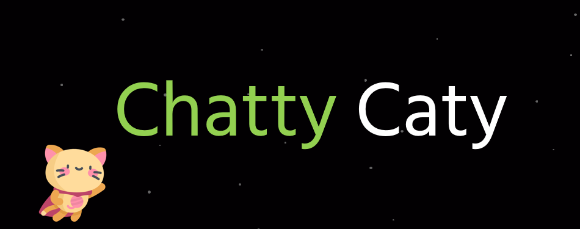

[](https://choosealicense.com/licenses/mit/)
## Overview

ChattyCaty is an open-source project which demonstrates an infrastructure to create a polymorphic program using GPT models.

---

## Disclaimer
This open source project is provided for research purposes only. The software is made available on an "as is" basis and without warranties of any kind, express or implied. The user assumes all responsibility for any consequences resulting from the use or modification of this software. CyberArk and the developer(s) of this project make no representations or warranties about the suitability, reliability, availability, timeliness, or accuracy of this software, and disclaim all liability for any damages, including direct, indirect, incidental, consequential, or punitive damages, arising out of the use or inability to use this software or any information provided herein. Use of this software indicates acceptance of these terms and conditions.
This project is aimed to be used for defensive purposes and not to be used in a malicious way. To ensure this, the GPT queries or function validations implementation were omitted from the project source code.

## Usage

1. In this repo there are three different artifacts:
    1. C&C - Command and control http server
    2. Agent - The regular agent
    3. ValidatorAgent - The validation agent
2. You need to change the C&C domain / IP address in both the validator agent and the regular agent according to your setup.
3. Run C&C
```bash
cd CommandAndControl
python main.py
```
4. Run at least one validator agent on a system that matches the platform you would like to test (Windows / Linux / MacOS / etc)
5. Run the "agent" on the target machine
6. Login to the C&C
    1. There are two default accounts that are created, you can simply log in with the following credentials - admin:admin
7. Profit

## References:

For more comments, suggestions, or questions, you can contact Omer Tsarfati ([@OmerTsarfati](https://twitter.com/OmerTsarfati)) / Eran Shimony ([@EranShimony](https://twitter.com/EranShimony)) and CyberArk Labs.
You can find more projects developed by us in https://github.com/cyberark/.